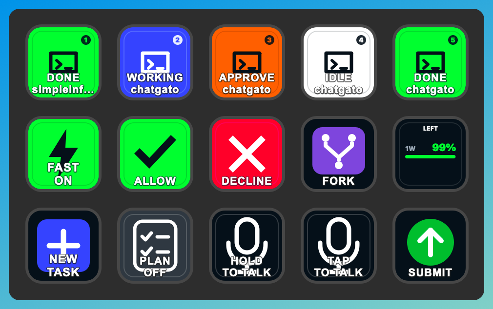

# ChatGato

<p align="center">
  
</p>

A Stream Deck plugin to control the OpenAI ChatGPT desktop app (Codex).
No API key required.

## Features

- Keep track of up to 20 **Agent Status** keys, showing the task's project, status (working, done, require approval, etc). On press, they open the task.
- **Usage Limits** shows the percentage left in Codex's current rate-limit windows and refreshes from local Codex task data.
- **Prompt** starts a task with any custom prompt
- Buttons to run shortcuts in Codex, such as:
  - **Allow** / **Decline**
  - **Push to Talk** / **Tap to Talk**
  - **Fast Mode** (shows if active)
  - **Plan Mode** (shows if active)
  - **Increase reasoning** / **Decrease reasoning**
  - **New Task**
  - **Submit**
  - **Fork**
  - **Review**
- Navigation: **Review tab**, **Terminal**, **Scheduled**, **Settings**, **Skills**, **Go Back**, **Go Forward**, and **Toggle Sidebar**.

## Layout example

<p align="center">
  
</p>

For each Agent Status key, choose a different slot from 1–20.
Optionally set an absolute workspace path to filter the keys to one project.

## Requirements

- Stream Deck 7.1 or newer
- macOS 13+ or Windows 10+
- A Stream Deck device; Stream Deck+ is optional for dial control
- The Fast and Plan keyboard shortcuts configured in ChatGPT as described below
- On macOS, allow Elgato Accessibility permission if prompted to allow keyboard-driven
  actions such as Submit and Fork.

### Required Fast and Plan shortcut setup

ChatGPT exposes app-scoped Fast and Plan commands, but does not assign the bindings ChatGato uses. Configure them once:

1. Open ChatGPT desktop.
2. Open **Settings → Keyboard Shortcuts**.
3. Search for **“Toggle Fast mode”** and assign the required Fast shortcut.
4. Search for **“Toggle plan mode”** and assign the required Plan shortcut.
5. Use the exact platform-specific bindings below.

| Platform | Fast                   | Plan                   |
| -------- | ---------------------- | ---------------------- |
| macOS    | Command+Option+Shift+F | Command+Option+Shift+P |
| Windows  | Ctrl+Alt+Shift+F       | Ctrl+Alt+Shift+P       |

**The ChatGato Fast and Plan buttons will not work until these shortcuts are configured exactly.** A warning or alert means ChatGato could not send the shortcut to ChatGPT.

## Build and install for development

```bash
npm install
npm run link
```

After linking, drag actions from that category onto keys or a Stream Deck+ dial.

## Troubleshooting

### Finding the plugin logs

If a key shows a warning triangle, start with `com.marco.chatgato.0.log`. Stream Deck
stores it inside the installed plugin directory at:

| Platform | Log file                                                                                                                |
| -------- | ----------------------------------------------------------------------------------------------------------------------- |
| macOS    | `~/Library/Application Support/com.elgato.StreamDeck/Plugins/com.marco.chatgato.sdPlugin/logs/com.marco.chatgato.0.log` |
| Windows  | `%APPDATA%\Elgato\StreamDeck\Plugins\com.marco.chatgato.sdPlugin\logs\com.marco.chatgato.0.log`                         |

After running `npm run link` for development, the installed plugin is linked to this
checkout, so the same file is also available at
`com.marco.chatgato.sdPlugin/logs/com.marco.chatgato.0.log` relative to the repository
root. The `.0.log` file is the current log; higher-numbered files are older rotated
logs. Automation failures include the selected action and the operating-system error.

To create a distributable plugin:

```bash
npm run pack
```

## How live status works

The plugin reads Codex's `state_5.sqlite` from `sqlite_home` in
`$CODEX_HOME/config.toml` when configured, then `CODEX_SQLITE_HOME`, and otherwise
`CODEX_HOME` (normally `~/.codex`). Relative SQLite locations resolve from the
plugin's current working directory. Rollout files and `models_cache.json` remain
under `CODEX_HOME`. See the official
[Codex environment-variable documentation](https://learn.chatgpt.com/docs/config-file/environment-variables).

This is an integration with Codex's internal, version-sensitive SQLite schema,
not a public or stable state API. Codex releases may change the database filename,
tables, columns, or rollout event format and require a corresponding plugin update.
The plugin does not transmit task titles, paths, prompts, or status anywhere.
Status changes are polled every two seconds by default.

Completion is shown as green/unread. Pressing that Agent key acknowledges the completion and opens the task, changing the key to idle white until the task updates again.

The Usage Limits key reads the latest account-wide Codex rate-limit snapshot that Codex writes to local task rollouts. It displays remaining allowance rather than consumed allowance; for example, a Codex `used_percent` value of 18 is shown as 82% left. Press the key to refresh immediately. The snapshot advances when Codex reports usage during a task, so it can remain unchanged while Codex is idle.

## Notes and limitations

- Agent status is inferred from internal local Codex state and rollout events. It intentionally avoids private app IPC and cloud APIs.
- Usage limits are also read locally from Codex rollout events; no account credentials or usage data are transmitted by the plugin.

## Why this name?

The name **ChatGato** combines both:

- the words for “cat” in French (`chat`), and Spanish (`gato`).
- the words ChatGPT and Elgato, the makers of the Stream Deck.

## Disclaimer

- This app was partially vibe-coded: the maintainer didn't read all its code.
- ChatGato is an independent Stream Deck plugin and is not affiliated with or endorsed by OpenAI or Elgato.
