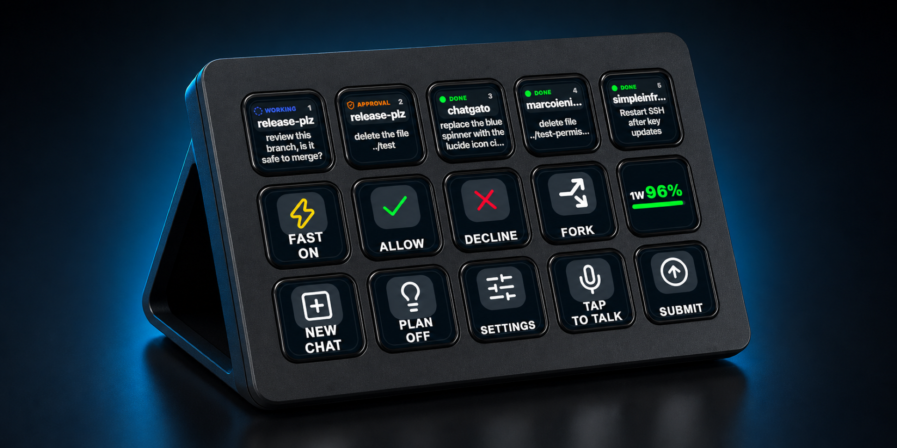

# ChatGato

**A Stream Deck plugin to control the OpenAI ChatGPT desktop app (Codex).**<br>
No API key or login required.

<p align="center">
  
</p>

## Features


- Keep track of up to 20 **Agent Status** keys, showing each top-level chat's project and status (working, done, require approval, etc). Subagents progress is shown as well. On press, the keys open the chat.
- **Usage Limits** shows the percentage left in Codex's current rate-limit windows and refreshes from Codex's local app-server.
- **Prompt** starts a chat with any custom prompt
- Buttons to run shortcuts in Codex, such as:
  - **Allow** / **Decline**
  - **Push to Talk** / **Tap to Talk**
  - **Fast Mode** (shows if active)
  - **Plan Mode** (shows if active)
  - **Increase reasoning** / **Decrease reasoning**
  - **New Chat**
  - **Submit**
  - **Fork**
  - **Review**
- Navigation: **Review tab**, **Terminal**, **Scheduled**, **Settings**, **Skills**, **Go Back**, **Go Forward**, and **Toggle Sidebar**.

<br clear="right">

## Requirements

- Stream Deck 7.1 or newer
- macOS 13+ or Windows 10+
- A Stream Deck device; Stream Deck+ is optional for dial control
- The Search Chats, Fast, and Plan keyboard shortcuts configured in ChatGPT as described below
- On macOS, allow Elgato Accessibility permission if prompted to allow keyboard-driven
  actions such as Submit and Fork.

## Setup

Install the plugin and assign the keys you want.
For each Agent Status key, choose a different slot from 1–20.
Optionally set an absolute workspace path to filter the keys to one project.

### Keyboard shortcuts

ChatGPT exposes app-scoped Search Chats, Fast, and Plan commands, but does not assign them by default. Configure them once; ChatGato reads your chosen bindings from `.codex/keybindings.json` whenever an action runs:

1. Open ChatGPT desktop.
2. Open **Settings → Keyboard Shortcuts**.
3. Search for **“Switch chat”** and assign any shortcut you prefer.
4. Search for **“Toggle Fast mode”** and assign any shortcut you prefer.
5. Search for **“Toggle plan mode”** and assign any shortcut you prefer.

**Remote Agent Status navigation and the ChatGato Fast and Plan buttons will not work until their shortcuts are configured.** Search Chats is only needed for SSH-hosted chats; local chats use exact Codex links. ChatGato reads and validates the current Search Chats binding before sending a remote chat title, so shortcut changes take effect immediately.

## Build and install for development

```bash
npm install
npm run link
```

After linking, drag actions from that category onto keys or a Stream Deck+ dial.

## Troubleshooting

### Finding the plugin logs

If a key shows a warning triangle, start with `com.marco.chatgato.0.log`. Stream Deck
stores it inside the installed plugin directory at:

| Platform | Log file                                                                                                                |
| -------- | ----------------------------------------------------------------------------------------------------------------------- |
| macOS    | `~/Library/Application Support/com.elgato.StreamDeck/Plugins/com.marco.chatgato.sdPlugin/logs/com.marco.chatgato.0.log` |
| Windows  | `%APPDATA%\Elgato\StreamDeck\Plugins\com.marco.chatgato.sdPlugin\logs\com.marco.chatgato.0.log`                         |

After running `npm run link` for development, the installed plugin is linked to this
checkout, so the same file is also available at
`com.marco.chatgato.sdPlugin/logs/com.marco.chatgato.0.log` relative to the repository
root. The `.0.log` file is the current log; higher-numbered files are older rotated
logs. Automation failures include the selected action and the operating-system error.

To create a distributable plugin:

```bash
npm run pack
```

## How live status works

The plugin reads Codex's `state_5.sqlite` from `sqlite_home` in
`$CODEX_HOME/config.toml` when configured, then `CODEX_SQLITE_HOME`, and otherwise
`CODEX_HOME` (normally `~/.codex`). Relative SQLite locations resolve from the
plugin's current working directory. For SSH projects saved in the ChatGPT desktop
app, it discovers the configured host and project path from Codex's global state,
then uses the remote host's documented `codex app-server` over the same SSH
connection to read its recent chat metadata.

Rollout files and `models_cache.json` remain under `CODEX_HOME`. See the official
[Codex environment-variable documentation](https://learn.chatgpt.com/docs/config-file/environment-variables).
Remote discovery requires the same working SSH alias and remote `codex` command
as the desktop app's
[SSH connection setup](https://learn.chatgpt.com/docs/remote-connections#connect-to-an-ssh-host).

Local discovery integrates with Codex's internal, version-sensitive SQLite
schema, while remote discovery combines the documented app-server API with the
desktop app's internal saved-project state. Codex releases may change these
formats and require a corresponding plugin update. The plugin does not send chat
titles, paths, prompts, or status to a cloud service or third party; remote chat
metadata only crosses the user-configured SSH connection. Status changes are
polled every two seconds by default.

The Usage Limits key launches the locally installed `codex app-server` and uses
its documented `account/rateLimits/read` method on every refresh. It selects the
canonical `codex` bucket rather than model-specific meters.
Press the usage key to refresh.

## Notes and limitations

- Agent status is inferred from local or SSH-hosted Codex state and rollout events. It intentionally avoids private app IPC and cloud APIs.
- Usage limits use the public local [Codex app-server protocol](https://learn.chatgpt.com/docs/app-server), with local rollout events as fallback. ChatGato does not read account credentials or call a private remote HTTP endpoint.

## Why this name?

The name **ChatGato** combines both:

- the words for “cat” in French (`chat`), and Spanish (`gato`).
- the words ChatGPT and Elgato, the makers of the Stream Deck.

## Disclaimer

- This app was partially vibe-coded: the maintainer didn't read all its code.
- ChatGato is an independent Stream Deck plugin and is not affiliated with or endorsed by OpenAI or Elgato.

> [!NOTE]
> ChatGato processes Codex chat data and plugin settings locally and does not send
> them to the developer or third parties. See the [Privacy Policy](PRIVACY.md) for
> the data it reads, optional SSH behavior, retention, and deletion instructions.
