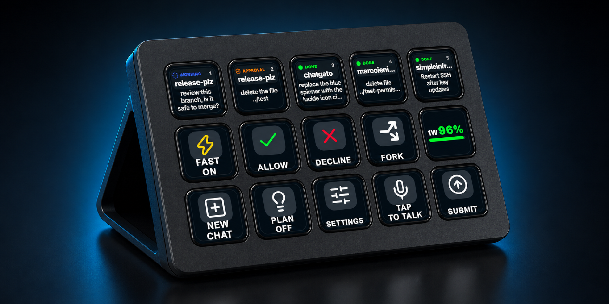

# ChatGato



**A Stream Deck plugin for Codex controls and live Codex / T3 Code thread status.**<br>
No API key or login required.

<br clear="left">

## Features


- Keep track of up to 20 **Agent Status** slots per source, showing each top-level chat's project and status (working, done, require approval, etc). Choose Codex or T3 Code on each key. Pressing a Codex key opens the chat; pressing a T3 Code key opens the chat on macOS or focuses the T3 Code app on Windows. Codex keys also show subagent progress.
- **Usage Limits** shows the percentage left in Codex's current rate-limit windows and refreshes from Codex's local app-server.
- **Prompt** starts a chat with any custom prompt
- Buttons to run shortcuts in Codex, such as:
  - **Allow** / **Decline**
  - **Push to Talk** / **Tap to Talk**
  - **Fast Mode** (shows if active)
  - **Plan Mode** (shows if active)
  - **Increase reasoning** / **Decrease reasoning**
  - **New Chat**
  - **Submit**
  - **Fork**
  - **Review**
- Navigation: **Review tab**, **Terminal**, **Scheduled**, **Settings**, **Skills**, **Go Back**, **Go Forward**, and **Toggle Sidebar**.

<br clear="right">

## Requirements

- Stream Deck 7.1 or newer
- macOS 13+ or Windows 10+
- A Stream Deck device; Stream Deck+ is optional for dial control
- For Codex controls: the Switch chat, Fork chat, Toggle Fast mode, and Toggle plan mode keyboard shortcuts configured in ChatGPT as described below
- On macOS, allow Elgato Accessibility permission if prompted to allow keyboard-driven
  actions such as Submit and Fork.

## Setup

Install the plugin and assign the keys you want.
For each Agent Status key, choose an app and a different slot from 1–20 for that source.
Optionally set an absolute workspace path to filter the keys to one project.

### T3 Code

1. Add an **Agent Status** key and choose **App → T3 Code**.
2. Assign slots 1–20. All T3 keys show the most recent threads across the local
   computer, SSH connections, and T3 Connect environments saved in T3 Code.
   You do not select a machine on each key. Connections that are removed or
   disabled in T3 are excluded.
3. Leave **T3 home** empty for the local `~/.t3` installation, or enter the
   absolute local directory containing `userdata`. This also selects the saved
   connection registry. Remote machines use their own `~/.t3` directory. The
   reader honors `T3CODE_HOME` when available in the environment on that machine.
4. Optionally set a workspace filter, which applies on every machine and
   includes project worktrees. Archived and deleted threads are excluded.

ChatGato reads `userdata/connection-catalog.json`, or the older
`userdata/saved-environments.json` when no catalog exists. The encrypted catalog
is unlocked locally using T3's macOS Keychain entry or Windows user key; macOS
may request Keychain access. Choose **Allow** for the current request, not
**Always Allow**. The requester is the shared `/usr/bin/security` utility;
persistent permission would let other processes use that utility to access the
same entry. ChatGato uses this system utility to avoid distributing a native
Keychain helper. It waits for you to answer the prompt, so T3 keys may remain
pending until you allow or deny access. Only SSH connection metadata is retained
in memory.
If the catalog cannot be unlocked, the key shows an error and unlock attempts
are retried at most once a minute. Encrypted catalog discovery is supported on
macOS and Windows, the platforms supported by Stream Deck.

Remote reads require SSH key/agent authentication and Node.js 22.13+ available
as `node` in the remote SSH shell. Connect with the saved destination in a
terminal first to establish trust; ChatGato does not prompt for SSH passwords
or accept unknown host keys. Saved usernames and ports are honored, and your
SSH config supplies options such as identity files and jump hosts. ChatGato
only contacts SSH connections saved in T3; it does not scan your SSH config.
T3 Connect threads are read from T3's local desktop thread cache. Keep T3 Code
open and connected so that cache stays current. ChatGato reads the cache files
without locking or modifying them, decodes only thread summaries, and makes no
relay API requests. Disabled or removed environments are excluded.
Direct URL connections are not currently supported.
No remote helper installation is required. Existing per-key SSH host settings
are ignored; save those connections in T3 Code if they are not already there.

**On macOS, pressing a T3 Code thread key opens that exact chat**, including
chats on saved SSH connections. ChatGato uses T3’s Command-K palette to search
by thread ID, then verifies the selected thread and environment before
acknowledging completion. This requires a recent T3 version with thread-ID
search, the default Command-K search shortcut, and Stream Deck Accessibility
permission. If the chat cannot be opened, the key alerts and stays unacknowledged.
On Windows, pressing the key still focuses T3 Code and acknowledges the key.
T3’s desktop protocol does not yet support individual thread links. Other
ChatGato actions, including approval shortcuts, remain Codex controls.

T3 status comes from read-only SQLite queries, supporting both
`userdata/state.sqlite` and the newer `userdata/statev2.sqlite` (preferred when
present). It shows working, done, approval/input waits, errors, and idle states
across T3's providers. These are internal, version-sensitive schemas. Machines
with missing or incompatible databases or failed SSH reads are omitted and
retried; if no machine can be read, the key shows an error. A successful read
with no matching threads shows an empty key.
Status reflects persisted state and may remain stale if T3 stops unexpectedly.
T3 Connect status can also remain stale while its environment is disconnected.
Reads are shared across keys and refresh every two seconds by default.
A slow or unreachable SSH host can delay a refresh by up to ten seconds.

### Keyboard shortcuts

ChatGPT exposes app-scoped Switch chat, Fork chat, Toggle Fast mode, and Toggle plan mode commands, but does not assign them by default. Configure them once; ChatGato reads your chosen bindings from `.codex/keybindings.json` whenever an action runs:

1. Open ChatGPT desktop.
2. Open **Settings → Keyboard Shortcuts**.
3. Search for **“Switch chat”** and assign any shortcut you prefer.
4. Search for **“Fork chat”** and assign any shortcut you prefer.
5. Search for **“Toggle Fast mode”** and assign any shortcut you prefer.
6. Search for **“Toggle plan mode”** and assign any shortcut you prefer.

**Remote Agent Status navigation and the ChatGato Fork, Fast, and Plan buttons will not work until their shortcuts are configured.** Switch chat is only needed for SSH-hosted chats; local chats use exact Codex links. ChatGato reads and validates the relevant binding immediately before sending it, so shortcut changes take effect without rebuilding or restarting the plugin.

## Install

Install with one click from the [Elgato marketplace](https://marketplace.elgato.com/product/chatgato-8a785f44-884c-4938-9b14-d135d04773aa).

## Build and install for development

```bash
npm install
npm run link
```

After linking, drag actions from that category onto keys or a Stream Deck+ dial.

## Troubleshooting

### Finding the plugin logs

If a key shows a warning triangle, start with `com.marco.chatgato.0.log`. Stream Deck
stores it inside the installed plugin directory at:

| Platform | Log file                                                                                                                |
| -------- | ----------------------------------------------------------------------------------------------------------------------- |
| macOS    | `~/Library/Application Support/com.elgato.StreamDeck/Plugins/com.marco.chatgato.sdPlugin/logs/com.marco.chatgato.0.log` |
| Windows  | `%APPDATA%\Elgato\StreamDeck\Plugins\com.marco.chatgato.sdPlugin\logs\com.marco.chatgato.0.log`                         |

After running `npm run link` for development, the installed plugin is linked to this
checkout, so the same file is also available at
`com.marco.chatgato.sdPlugin/logs/com.marco.chatgato.0.log` relative to the repository
root. The `.0.log` file is the current log; higher-numbered files are older rotated
logs. Automation failures include the selected action and the operating-system error.

To create a distributable plugin:

```bash
npm run pack
```

## How live status works

For Codex keys, the plugin starts one lazy, long-lived local `codex app-server` process and shares
its documented stdio JSON-RPC connection across every key. `thread/list` and
`thread/turns/list` provide recent chat metadata and status, `config/read` provides
Fast mode, `model/list` provides reasoning choices, and
`account/rateLimits/read` plus `account/rateLimits/updated` provide usage. Thread,
config, and rate-limit notifications trigger immediate key refreshes; one-to-two-second
reconciliation polling covers persisted or unloaded threads.

ChatGato targets the current app-server protocol and does not fall back when a
required RPC is missing. Usage, Fast mode, model choices, and local task discovery
show an offline/error state until the shared connection recovers.

Two direct Codex persisted-state reads remain because the current protocol does not
expose the required information. Rollout JSONL supplies Plan mode and the extra
detail needed for unloaded or ambiguous active tasks, including approval and user
input waits. SQLite supplies only the active task's selected model and reasoning
effort; supported choices still come from `model/list`. ChatGato does not use
Codex SQLite for task discovery and does not read `models_cache.json` or `config.toml`
as RPC fallbacks. The SQLite location comes from `sqlite_home` in
`$CODEX_HOME/config.toml`, then `CODEX_SQLITE_HOME`, and otherwise `CODEX_HOME`
(normally `~/.codex`). Relative locations resolve from the plugin's current
working directory. See the official
[Codex environment-variable documentation](https://learn.chatgpt.com/docs/config-file/environment-variables).

For SSH projects saved in the ChatGPT desktop app, ChatGato discovers the
configured host and project path from Codex's global state, then uses the remote
host's documented `codex app-server` over the same SSH connection to read its
recent chat metadata.

Remote discovery requires the same working SSH alias and remote `codex` command
as the desktop app's
[SSH connection setup](https://learn.chatgpt.com/docs/remote-connections#connect-to-an-ssh-host).

The normal local path uses the documented app-server API. The two persisted-state
gaps above and remote-project discovery still include internal, version-sensitive
formats. The plugin does not send chat titles, paths, prompts, or status to a
third-party service; remote chat metadata only crosses the user-configured SSH
connection. The Usage Limits key selects the canonical `codex` bucket rather than
model-specific meters. Press the usage key to force a refresh.

## Notes and limitations

- Codex agent status prefers app-server runtime and turn state, with rollout inference for unloaded or ambiguous active threads. It intentionally avoids private app IPC and cloud APIs.
- Usage limits use only the public local [Codex app-server protocol](https://learn.chatgpt.com/docs/app-server). ChatGato does not read account credentials or call a private remote HTTP endpoint.

## Why this name?

The name **ChatGato** combines both:

- the words for “cat” in French (`chat`), and Spanish (`gato`).
- the words ChatGPT and Elgato, the makers of the Stream Deck.

## Disclaimer

- This app was partially vibe-coded: the maintainer didn't read all its code.
- ChatGato is an independent Stream Deck plugin and is not affiliated with or endorsed by OpenAI or Elgato.

> [!NOTE]
> ChatGato processes Codex and T3 Code thread data and plugin settings locally and does not send
> them to the developer or third parties. See the [Privacy Policy](PRIVACY.md) for
> the data it reads, optional SSH behavior, retention, and deletion instructions.
